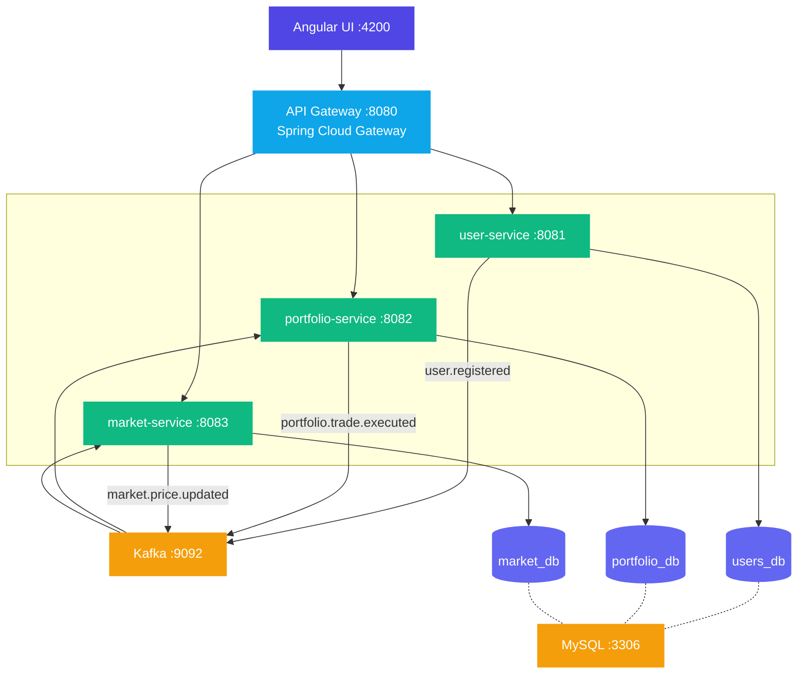

# StockFlow - Portfolio Management Platform

A microservice-based stock portfolio manager built with Java 17, Spring Boot, Angular 17, Kafka, and MySQL. Users can register, build a portfolio of stocks, execute simulated buy/sell trades, and view live (mocked) market prices.

## Architecture



## Services

| Service | Port | Description |
|---------|------|-------------|
| **api-gateway** | 8080 | Routes requests to backend services, CORS config |
| **user-service** | 8081 | Registration, login, profile (BCrypt, Kafka producer) |
| **portfolio-service** | 8082 | Holdings, buy/sell trades (Kafka consumer & producer) |
| **market-service** | 8083 | Stock prices, price history, 30s scheduled price refresh |
| **stockflow-ui** | 4200 | Angular 17 SPA with Highcharts Dashboards |
| **MySQL** | 3306 | Databases: users_db, portfolio_db, market_db |
| **Kafka** | 9092 | Async messaging between services |
| **ReportPortal** | 8086 | E2E test reporting dashboard (login: `superadmin` / `admin`) |

## Environment Requirements

| Tool | Version | Required For |
|------|---------|--------------|
| **Docker** | 20.10+ | Running the full stack |
| **Docker Compose** | v2+ | Orchestrating all containers |
| **Java** | 17+ | Local backend development |
| **Gradle** | 8.7+ | Local backend builds (wrapper included) |
| **Node.js** | 20+ | Local frontend development |
| **npm** | 9+ | Angular dependency management |

> Docker and Docker Compose are the only hard requirements. Everything else is only needed for local development outside Docker.

## Quick Start (Docker)

```bash
# Clone and navigate to the project
cd StockFlow

# Start all services
docker-compose up --build
```

Wait for all services to start (first build takes a few minutes), then open:
- **UI**: http://localhost:4200
- **API Gateway**: http://localhost:8080
- **Actuator health checks**: http://localhost:8081/actuator/health, etc.

To force a full rebuild after code changes (Docker may cache old layers):
```bash
docker-compose build --no-cache
docker-compose up -d
```

To stop:
```bash
docker-compose down
```

To stop and remove data volumes:
```bash
docker-compose down -v
```

## Local Development

The recommended workflow is to run infrastructure and stable services in Docker, while running the service you're actively developing from IntelliJ (or your IDE) for debugger access and hot reload.

### Recommended dev setup

| Component | Run in | Why |
|-----------|--------|-----|
| MySQL, Zookeeper, Kafka, Kafka UI | Docker | Infrastructure, no code changes |
| Services you're **not** editing | Docker | Stable, no need to rebuild |
| Service you're actively editing | IntelliJ / IDE | Hot reload, debugger, breakpoints |
| Angular UI | `npm start` | Live reload, proxy flexibility |

### Example: developing market-service locally

**1. Start everything except market-service:**
```bash
docker-compose up -d mysql zookeeper kafka kafka-ui user-service portfolio-service api-gateway stockflow-ui
```

**2. Run market-service from IntelliJ:**

Open `MarketServiceApplication.java` and click Run/Debug.

Since Docker MySQL is mapped to port `3307` on the host, override the datasource URL in IntelliJ's run configuration:

`Run → Edit Configurations → Environment variables:`
```
SPRING_DATASOURCE_URL=jdbc:mysql://localhost:3307/market_db
```

Alternatively, create `src/main/resources/application-local.yml`:
```yaml
spring:
  datasource:
    url: jdbc:mysql://localhost:3307/market_db
```
Then add `--spring.profiles.active=local` to the program arguments.

**3. Accessing the local service:**

The API Gateway routes to Docker hostnames (e.g. `http://market-service:8083`), so it won't reach your locally running service. Two options:

- **Direct access:** Hit `http://localhost:8083` directly for API calls
- **Angular dev server (recommended):** Run the UI with `npm start` and update `proxy.conf.json` to point the market route to `http://localhost:8083`

### Example: developing the Angular UI locally

**1. Start the backend stack:**
```bash
docker-compose up -d mysql zookeeper kafka kafka-ui user-service portfolio-service market-service api-gateway
```

**2. Run Angular dev server:**
```bash
cd stockflow-ui
npm install
npm start
```

Serves at http://localhost:4200 with live reload. The `proxy.conf.json` forwards API calls (`/users/**`, `/portfolio/**`, `/market/**`) to the API Gateway at `localhost:8085`, so no CORS issues.

Changes to templates, styles, and TypeScript files are reflected instantly in the browser without restarting.

### Running all backend services locally

Start infrastructure only:
```bash
docker-compose up -d mysql zookeeper kafka kafka-ui
```

Then run each service with Gradle:
```bash
cd user-service
SPRING_DATASOURCE_URL=jdbc:mysql://localhost:3307/users_db ../gradlew bootRun
```

Each service's `application.yml` defaults to `localhost` for Kafka connections. Only the MySQL port needs overriding (`3307` instead of `3306`).

### Frontend

```bash
cd stockflow-ui
npm install
npm start
```

Serves at http://localhost:4200 with a proxy forwarding `/users/**`, `/portfolio/**`, `/market/**` to the API Gateway at `localhost:8080`.

### ReportPortal (E2E Test Reporting)

Available at http://localhost:8086/ui when running via Docker. Records test results from the `e2e-tests` module.

| | |
|---|---|
| **URL** | http://localhost:8086/ui |
| **Login** | `superadmin` |
| **Password** | `admin` |
| **Project** | `e2e_tests` |

To run e2e tests and report results to ReportPortal:
```bash
./gradlew :e2e-tests:test
```

The test runner automatically obtains an API token from ReportPortal before execution. Results appear under the `e2e_tests` project as the "E2E Tests" launch.

### Kafka UI

Available at http://localhost:9090 when running via Docker. Browse topics, messages, and consumer groups.

### Debugging Kafka from CLI

```bash
# List topics
docker-compose exec kafka kafka-topics --list --bootstrap-server localhost:9092

# Read all messages from a topic
docker-compose exec kafka kafka-console-consumer --bootstrap-server localhost:9092 --topic user.registered --from-beginning

# Watch messages live
docker-compose exec kafka kafka-console-consumer --bootstrap-server localhost:9092 --topic market.price.updated

# Check consumer group lag
docker-compose exec kafka kafka-consumer-groups --bootstrap-server localhost:9092 --list
docker-compose exec kafka kafka-consumer-groups --bootstrap-server localhost:9092 --describe --group <group-id>
```

## Usage Flow

1. Open http://localhost:4200
2. **Register** a new account (portfolio is auto-created via Kafka)
3. **Dashboard** - view stock price bar chart, holdings pie chart, market overview table
4. **Market** - browse all stocks with live prices (refresh every 30s), view price history line chart
5. **Portfolio** - buy/sell stocks, view holdings column chart and trade history
6. **Profile** - view account details

## Kafka Topics

| Topic | Producer | Consumer | Purpose |
|-------|----------|----------|---------|
| `user.registered` | user-service | portfolio-service | Auto-create portfolio on signup |
| `portfolio.trade.executed` | portfolio-service | market-service | Log trade activity |
| `market.price.updated` | market-service | portfolio-service | Recalculate portfolio values |

## Database Migrations

Flyway runs automatically on service startup. Migration scripts are located in each service under:
```
src/main/resources/db/migration/
```

The MySQL init script (`mysql-init/init.sql`) creates the three databases on first container start.

## Tech Stack

**Backend**: Java 17, Spring Boot 3.5.11, Spring Cloud Gateway, Spring Data JPA, Spring Kafka, Flyway, Lombok, MySQL 8

**Frontend**: Angular 17, Highcharts, Highcharts Dashboards, TailwindCSS

**Infrastructure**: Docker, Docker Compose, Kafka (Confluent), Zookeeper, Nginx
